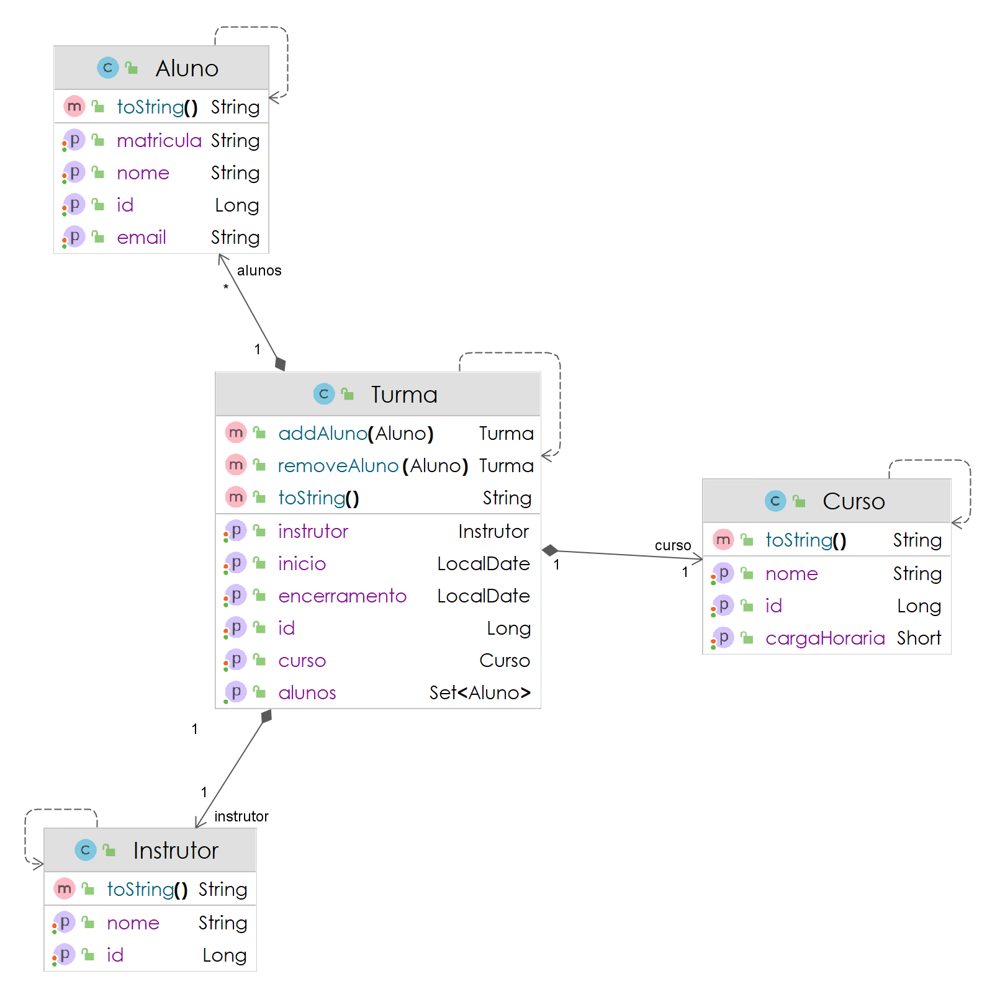
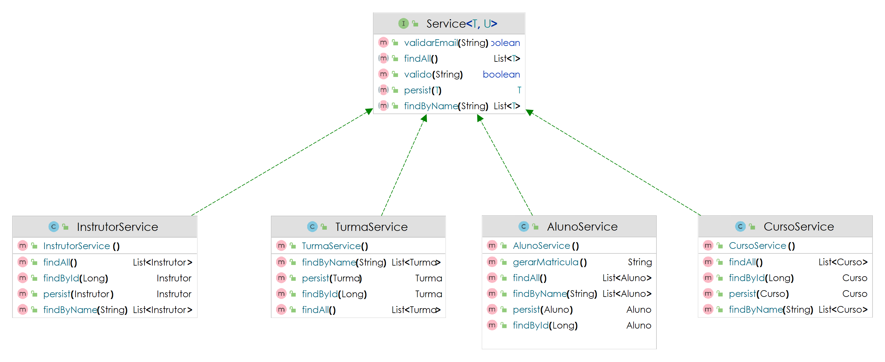
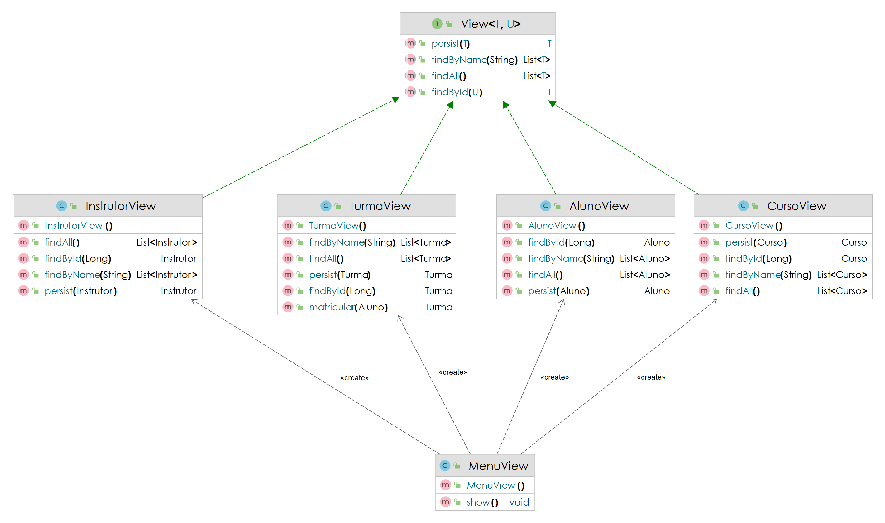

# ECOLE DE LANGUES BENEZINHO 🤓👍🏾

Domain Driven Design aplicada em 01/09/2023.

|               | **Domain Driven Design** |
|-----------------------------------------|--------------------------|
| **ALUNO:**                              | **TURMA:** 1TDSA         |
| **PROFESSOR:** Benefrancis do Nascimento | 01/09/2023               |
| **CP-I**                               | ****                     |

# Sumário

[Estudo de caso ](#_Estudo_de_caso)

[O que deverá ser feito? ](#_O_que_devera_ser_feito)

[Diagrama de Classes ](#_Diagrama_de_Classes)

[Como Entregar ](#_Entrega)

[Correção da Prova ](#_Correcao)

<a id="_Estudo_de_caso"></a>

# Estudo de caso

Nos últimos 5 anos nossa Holding cresceu 30%, a meta agora é expandir o negócio lançando um revolucionário Curso Online de Linguas.

Nossa equipe de analistas desenvolveu o Diagrama de Classes abaixo, e a sua missão é implementar código capaz de separar as responsabilidades das classes entre as camadas objetivando melhor legibilidade e manutenibilidade do código do programa.

Na sprint atual, você foi incumbido de fazer:

1. As classes responsáveis pelas regras de negócio da aplicação no pacote service.

2. A criação das classes responsáveis pela persistencia e recuperação dos dados no repositório

3. Desenvolver métodos capazes de persistir todos os objetos em List ou outra Collection;

4. A implementação de todos os métodos previstos nas interfaces Repository e Services (A views já estão implementadas):

<a id="_O_que_devera_ser_feito"></a>

# O que deverá ser feito?

**Você deverá:**

**Fazer o fork do projeto do github.**:

https://github.com/Benefrancis/ecole

Caso o github esteja indisponível, você deverá pegar o projeto no diretório compartilhado.

Alterar o arquivo contido em  **documentacao/equipe.txt** para incluir os RMs e nomes e turma da dupla que fará esta
atividade.

**OBS:** Será com base nos nomes contidos neste aquivo que eu irei atribuir a nota.

1. **(1 Pontos)** implementar corretamente a classe **AlunoService**.

   Lembre-se que:

   2. É necessário implementar corretamente os métodos da interface Service;


2. **(1 Ponto)** implementar corretamente a classe **CursoService**.

   Lembre-se que:

   1. É necessário implementar corretamente os métodos da interface Service;


3. **(1 Ponto)** implementar corretamente a classe **InstrutorService**.

   Lembre-se que:

   1. É necessário implementar corretamente os métodos da interface Service;

4. **(2 Pontos)** implementar corretamente a classe **TurmaService**.

   Lembre-se que:

   1. É necessário implementar corretamente os métodos da interface Service;


5. **(1 Pontos)** implementar corretamente a classe **AlunoRepository** .

   Lembre-se que:

   1. É necessário implementar corretamente os métodos da interface Repository;

6. **(1 Pontos)** implementar corretamente a classe **CursoRepository** .

   Lembre-se que:

   1. É necessário implementar corretamente os métodos da interface Repository;

7. **(1 Pontos)** implementar corretamente a classe **IntrutorRepository** .

   Lembre-se que:

   1. É necessário implementar corretamenteos métodos da interface Repository;

8. **(2 Pontos)** implementar corretamente a classe **TurmaRepository** .

   Lembre-se que:

   1. É necessário implementar corretamenteos métodos da interface Repository;

<a id="_Diagrama_de_Classes"></a>

# Diagrama de Classes de Entidade



# Diagrama de Classes de Serviço



# Diagrama de Classes de Visualização




<a id="_Entrega"></a>

# Como Entregar

**A entrega deverá ser feita pelo NAC no site nac.fiap.com.br**, porém não se esqueça de fazer o **commit** e **push** do projeto no github.

<a id="_Correcao"></a>

# Correção da Prova

Nos próximos dias, a correção da prova será disponibilizada no github do professor (branch correcao):

Para acessar digite no prompt:

```shell
git clone https://github.com/Benefrancis/ecole && cd ecole && git checkout correcao
```

A avaliação é em dupla.

Boa avaliação.
